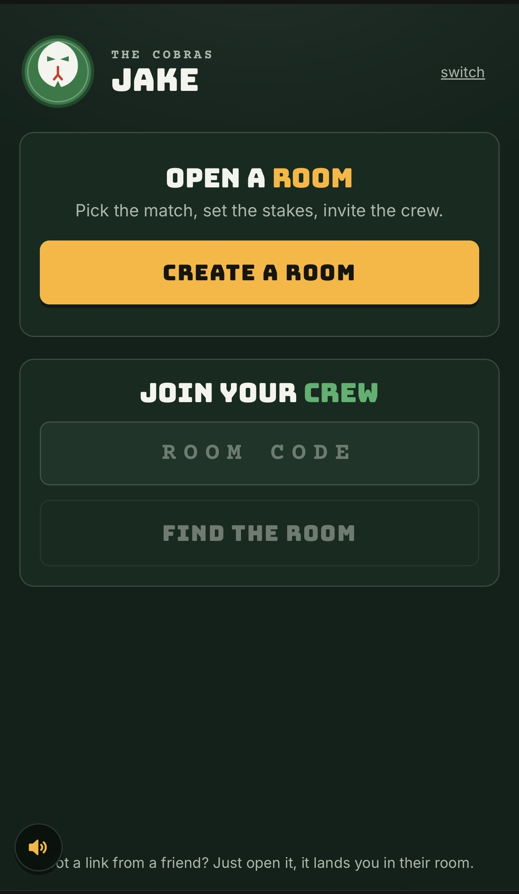
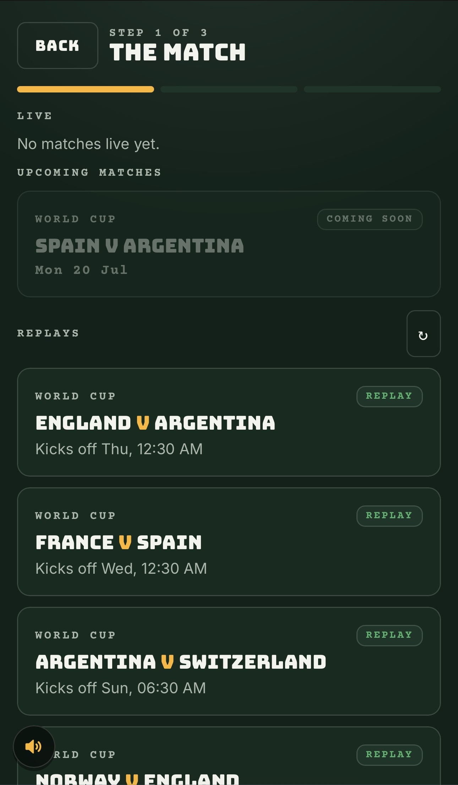
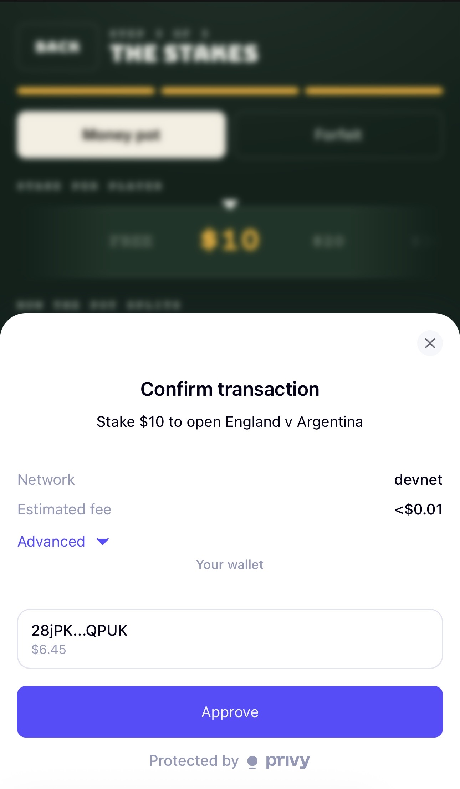
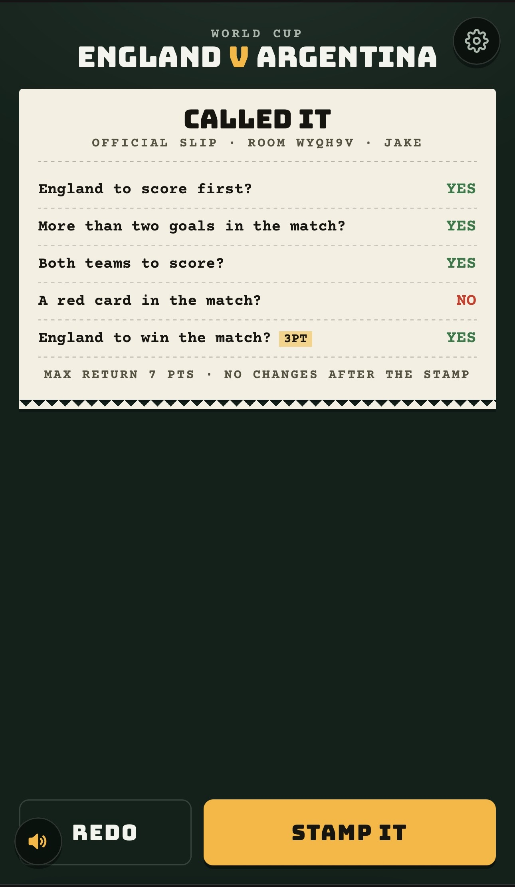
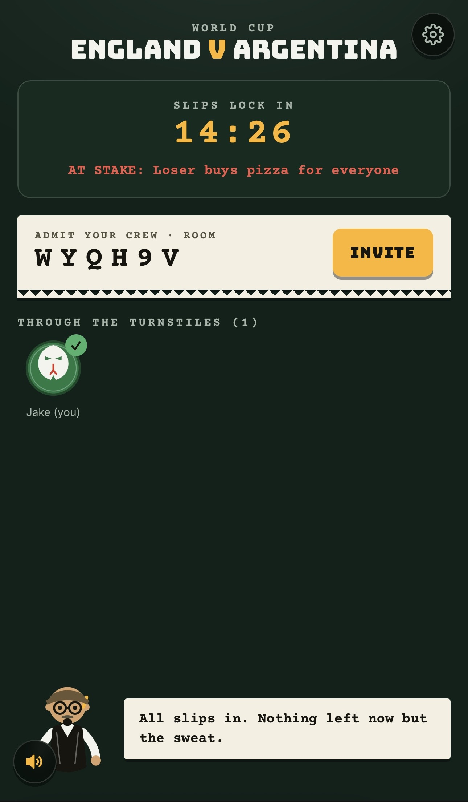
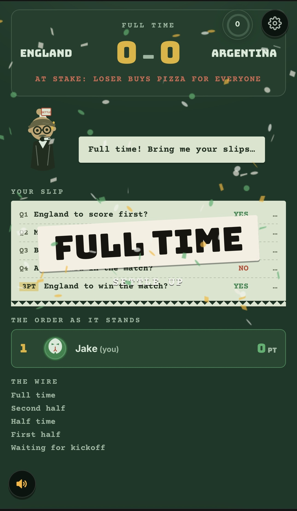

# Called It

A group prediction game for live football. A friend creates a room, everyone
joins with a link, and each player answers the same five swipe questions about
an upcoming match. As the match plays out, the room reacts live to goals, cards,
and penalties. At full time a leaderboard shows who called it, and the pot pays
out or the loser owes the agreed forfeit.

## Walkthrough

<table>
  <tr>
    <td width="33%"> <b>1. Lobby.</b> Pick a mascot and a name, then open a room or drop in a friend's code.</td>
    <td width="33%"> <b>2. Pick the match.</b> Real fixtures pulled from TxLINE, plus recorded matches to replay.</td>
    <td width="33%"> <b>3. The stakes.</b> Stake into a shared money pot, or set a forfeit for the loser instead.</td>
  </tr>
  <tr>
    <td width="33%"> <b>4. Call it.</b> Swipe right for yes, left for no on the five match questions.</td>
    <td width="33%"> <b>5. The slip.</b> Four one-point calls plus the three-point headline, then stamp it in.</td>
    <td width="33%"> <b>6. Admit the crew.</b> Share the room code, watch everyone come through, then wait on the whistle.</td>
  </tr>
  <tr>
    <td width="33%"> <b>7. Full time.</b> The room scores everyone, ranks the leaderboard, and settles the wager.</td>
  </tr>
</table>

## How the game works

1. One person creates a room and picks the wager.
   - Money: everyone stakes the same amount into a shared pot.
   - No money: the group agrees on a forfeit for the loser, such as buying pizza.
2. The app loads five questions for the chosen match. Four are worth one point
   each. The fifth is always "does team A win" and is worth three points.
3. Every player swipes right for yes or left for no, then locks in.
4. During the match the room updates live from the TxLINE data feed.
5. At full time the app scores everyone, shows the leaderboard, and settles the
   wager.

## Match data

Live scores and match events come from the TxLINE feed. The feed reports team
level events only (goals, cards, corners, penalties, and so on), so every
question is about a team or the match, never about a single player.

The feed is read on the server by a small worker. The worker keeps the TxLINE
credentials on the server, turns each incoming event into a normalized shape,
resolves any open questions, and writes the result to the database. Phones never
talk to TxLINE directly. They read updates from the database in real time.

The worker can also replay a recorded match log at a chosen speed. This is used
for demos so a full match can be shown in a couple of minutes without waiting
for a live fixture.

### TxLINE endpoints used

- `POST /auth/guest/start` - short lived guest token, used to open the score
  stream and to fetch historical data.
- `POST /api/token/activate` - exchanges a signed, on chain paid subscription
  for a persistent API token (`npm run txline:activate`, a one time setup
  step). This token unlocks the two endpoints below.
- `GET /api/scores/stream` - a Server-Sent Events stream of live match events.
  This is the one endpoint the whole live game loop is built on: the worker
  reads it, resolves questions from it, and every room's live screen is
  ultimately reflecting this stream.
- `GET /api/scores/historical/{fixtureId}` - the full event log for a finished
  match. Used once per match by `npm run pull:replays` to build the recorded
  fixtures under `data/replays`, so a full match can be replayed on demand
  instead of waiting for a real kickoff.
- `GET /api/fixtures/snapshot?startEpochDay=N` - upcoming fixtures, shown as
  "Coming soon" cards on the create room screen.

## The pot

When a room uses money, the stakes go into a Solana escrow program on devnet.
A fresh pool account is created for every room. Players deposit when they
join. At full time the backend computes the final standings from the match
result and asks the program to pay the winners. There is also a cancel path
that refunds everyone if a match is abandoned. Until the program id and a
settlement key are configured, the app runs the pot in mock mode with no on
chain transactions, so the game is fully playable without Solana set up.

## Wallets

Players sign in with a Privy embedded wallet (email or social login, no
extension needed). Local testing uses a throwaway browser keypair instead, so
`NEXT_PUBLIC_PRIVY_APP_ID` can stay blank while developing. Whichever wallet is
active, its balance and recent activity are visible from the settings menu
(top right gear icon), each transaction linking out to the Solana block
explorer.

## Project layout

- `src/app` - Next.js app router pages and API routes.
- `src/lib` - shared game logic: types, question bank, scoring, payout.
- `src/server` - server only code: TxLINE client, worker, database access.
- `anchor` - the Solana escrow program.
- `test` - unit tests for the scoring and question logic.

## Database

The schema lives in `supabase/migrations`. Apply it to a fresh Supabase
project either by pasting the SQL file into the project's SQL editor, or by
connecting the repo through Supabase's GitHub integration, which applies new
migrations on every push to `main`.

## Local setup

1. Install dependencies with `npm install`.
2. Copy `.env.example` to `.env.local` and fill in the values.
3. Apply the schema in `supabase/migrations` to your Supabase project.
4. Run the app with `npm run dev`.
5. Seed a couple of fixtures with `npm run seed`.
6. Run the match worker with `npm run worker`.

## Deploying for judges

The testing tools (New tester / Play / End game, in the settings menu) are
hidden on any production build by default, since a real deployment shouldn't
let a visitor drive someone else's match by hand. That also means a plain
production deploy has no way to advance a room without an actual live fixture
kicking off at the exact moment someone is testing it - not something a judge
can rely on.

For a judge facing deployment, set `NEXT_PUBLIC_ENABLE_DEV_TOOLS=1` to bring
those tools back. Advancing a replay runs as a single API call handled
in-process by the Next.js server (`src/server/dev/simulate.ts`) - no separate
always-on worker needs to be hosted for this to work. Then:

1. Run `npm run seed` against the deployed Supabase project. This adds a
   guaranteed sample replay fixture plus, if `npm run pull:replays` has been
   run, the real World Cup replays already checked into `data/replays`.
2. A judge creates (or opens) a room on one of the replay fixtures and uses
   Play to fast forward the match, or End game to jump straight to full time.

## Local mode without Supabase

For quick testing you can run the whole app with no hosted database at all. In
this mode every table is kept in a single JSON file, `.local-db.json`, that all
the processes share. Realtime is turned off, so the room screens fall back to
polling, which is enough to watch a game move.

1. Seed the fixtures into the local file with `npm run seed:local`.
2. Start the app with `npm run local`.
3. Replay a match with `npm run worker:local`.

Delete `.local-db.json` any time you want a clean slate. The file is ignored by
git so it never gets committed.

## Scripts

- `npm run dev` - start the app in development.
- `npm run local` - start the app in local mode, backed by a JSON file.
- `npm run mobile` - start the app and print a QR code for testing on a phone.
- `npm run build` - build for production.
- `npm run typecheck` - type check without emitting files.
- `npm run test` - run the unit tests.
- `npm run worker` - run the TxLINE match worker.
- `npm run worker:local` - run the match worker against the local JSON file.
- `npm run seed` - add sample fixtures to Supabase.
- `npm run seed:local` - add sample fixtures to the local JSON file.
- `npm run pull:replays` - pull finished matches from TxLINE to replay later.
- `npm run escrow:devnet` - exercise the pool program on devnet end to end.
- `npm run txline:activate` - activate a persistent TxLINE API token.
